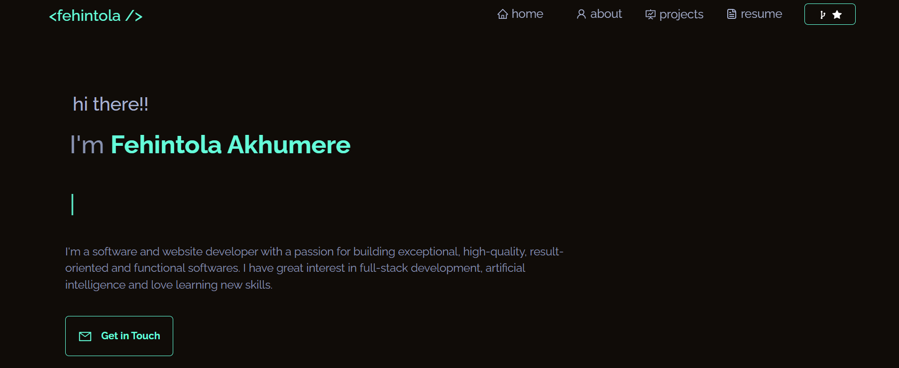

<p align ="center">
  
</p>
<h1 align = "center">
  Portfolio Website - v1
</h1>
<p align ="center">
  The first iteration of <a href="https://f3hint0la.netlify.com" target="_blank">Fehintola Akhumere's</a> portfolio built with <a href="https://react.dev" target="_blank">React.js</a> and hosted with <a href="https://www.netlify.com" target="_blank">Netlify</a>
</p>

<!--  -->

## 🛠 installation & set up

1. Install the dependencies

   ```sh
   npm install or yarn
   ```

2. Start the development server

   ```sh
   npm run start
   ```
